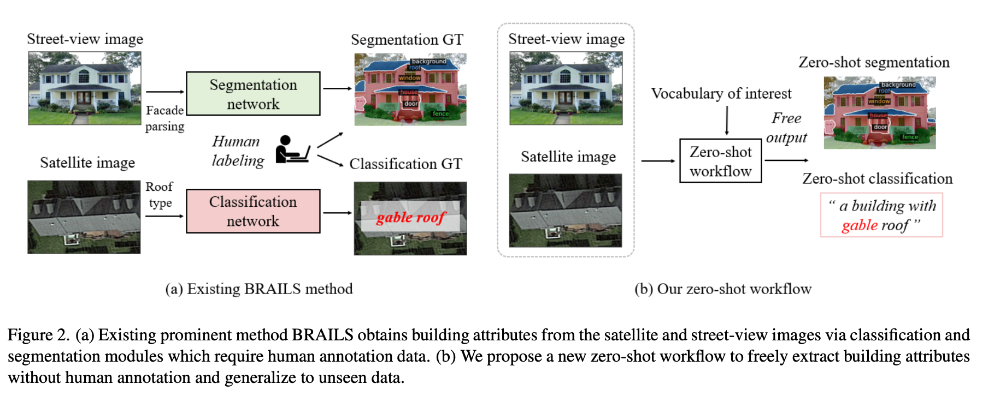

# Zero-shot Building Attribute Extraction from Large-Scale Vision and Language Models (WACV 2024)
(attach figure)
Fei Pan, Sangryul Jeon, Brian Wang, Frank Mckenna, Stella X. Yu


## Abstract 
Modern building recognition methods, exemplified by the BRAILS framework, utilize supervised learning to extract information from satellite and street-view images for im- age classification and semantic segmentation tasks. How- ever, each task module requires human-annotated data, hin- dering the scalability and robustness to regional variations and annotation imbalances. In response, we propose a new zero-shot workflow for building attribute extraction that uti- lizes large-scale vision and language models to mitigate reliance on external annotations. The proposed workflow contains two key components: image-level captioning and segment-level captioning for the building images based on the vocabularies pertinent to structural and civil engineer- ing. These two components generate descriptive captions by computing feature representations of the image and the vocabularies, and facilitating a semantic match between the visual and textual representations. Consequently, our framework offers a promising avenue to enhance AI-driven captioning for building attribute extraction in the structural and civil engineering domains, ultimately reducing reliance on human annotations while bolstering performance and adaptability.

By organizing and abstracting the technical details into convenient usage, we hope this demo could inspire more structural engineering researchers to unleash the power of these robust models and apply to their domains.

## Approach
### Image-level Classification
To perform classification task, we utilize [CLIP](https://github.com/openai/CLIP), an open-source, multi-modal model that has learned the relationship between language semantics and visual context. Given an image to be queried and task-related vocabularies, the model outputs the similarity of each task-related vocabulary to its queried image, then return vocabulary that most closely aligns with the visual context. 
### Pixel-level Segmentation
To perform segmentation, we take advantage of [SAM](https://github.com/IDEA-Research/Grounded-Segment-Anything). The strong zero-shot capability enables SAM to effectively process and segment objects in diverse scenarios and domains.We take advantage of SAM for segmenting residential objects including roofs, fence, doors, windows, and facades. 


## Getting Started
In this section, we will setup the required packages to run our experimented models - CLIP and SAM. On a GPU-equipped device, please setup conda (as instructed [here](https://conda.io/projects/conda/en/latest/user-guide/install/index.html)). After installing conda to provide virtual environment, below are the steps to setup all required python packages: 
**Step1; Setting Up Local Variables** 
```
export AM_I_DOCKER=False
export BUILD_WITH_CUDA=True
export CUDA_HOME=/path/to/cuda_device/
```
Note that this step is crucial to successfully setup model-dependent packages without error. 


**Step2: Installing Packages and Environments**
```
conda create --y --name zeroshot_extraction python=3.8.0
conda activate zeroshot_extraction
conda install --y -c pytorch pytorch=1.10.0 torchvision cudatoolkit=11.0
pip install ftfy regex tqdm pandas matplotlib==3.7.3

git clone https://github.com/BuildingInfoSys/zeroshot_attribute_extraction.git
pip install git+https://github.com/openai/CLIP.git
python -m pip install -e segment_anything
python -m pip install -e GroundingDINO
```
Note that python version has to be >=3.8.0, and pytorch(>=1.10.0) has to be compatible with CUDA device to successfully compile.

**Step3: Download Model's Pretrained Weights**
```
wget https://dl.fbaipublicfiles.com/segment_anything/sam_vit_h_4b8939.pth
wget https://github.com/IDEA-Research/GroundingDINO/releases/download/v0.1.0-alpha/groundingdino_swint_ogc.pth
```


## Usage
## Running This Repository
Below is the general command to run this repo:
```
python3 main.py --task TARGET_TASK --output_path YOUR_OUTPUT_PATH --data_dir DATA_PATH_TO_EVALUATED_IMAGES
```

To extract different attributes, simply set the task argument to your selected attribute.

#### Description of Arguments
- data_dir: path to target image(s)
    - Single-Image Inference: set data_dir argument to be the absolute path to the target image
    - Multi-Images Inference: Set data_dir argument to be the absolute path to the directory containing target images. 
- task: task to be evaluated. Current supported modes are segmentation, nFloors, roofType, and yearBuilt. 
    - **Task = "segmentation"**: segments out roof, fences, windows, doors, and facade.
    - **Task = "nFloors"**: predicts the number of stories of a given house. The default text prompts are limited to predicting one-story, two-story, and three-story houses
    - **Task = "roofType"** predicts the roof type of a given house. The default text prompts are limited to predicting flat/gable/hip roof shape
    - **Task = "yearBuilt"** predicts the year the given house is constructed. The default text prompts predicts "Pre-1970','1970-1979','1980-1989','1990-1999','2000-2009','Post-2010"
-  output_path: the output path that stores the prediction(in csv file) of given images from your data directory.

## Examples
TODO: (1) For each task, show some successful examples and sample code
Please refer to [GroundedSAM](https://github.com/IDEA-Research/Grounded-Segment-Anything/tree/main) and CLIP for more examples on the effectiveness of these models.

## Citing Our Paper(TODO)
```
@InProceedings{TODO,
  title = {Zero-shot Building Attribute Extraction from Large-Scale Vision and Language Models},
  author = {Pan, Fei and Jeon, Sangryul and Wang, Brian and Mckenna, Frank and Yu, Stella},
  booktitle = {IEEE/CVF Winter Conference on Applications of Computer Vision (WACV)},
  year = {2024}
}
```

